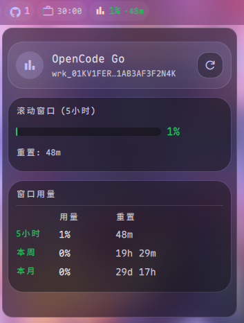

[English](README.en.md) | [🇨🇳 中文](README.md)

# OpenCode Go Usage — DankMaterialShell Plugin

Display OpenCode Go plan usage on DankBar, supporting 5-hour rolling window, weekly, and monthly usage tracking.

> 🤖 This repository's code is **100% generated by [OpenCode Go Plan](https://opencode.ai)'s DeepSeek 4 Flash** — I didn't write a single line.

## Preview



Shows current rolling window usage percentage and reset countdown on the bar:

```
📊 56% · 1h 30m
```

Click to open a detail panel with progress bars and a usage table for all three windows.

## Installation

```bash
mkdir -p ~/.config/DankMaterialShell/plugins
git clone https://github.com/zhangtingfeng-2000/opencode-go-usage ~/.config/DankMaterialShell/plugins/opencode-go-usage
```

Restart DankBar or run `pkill quickshell`.

### Optional: Remove non-essential files

After cloning, you can delete README and images to save space:

```bash
cd ~/.config/DankMaterialShell/plugins/opencode-go-usage
rm -f README.md README.en.md preview.png
```

## Configuration

Configure in DMS Settings → Plugins → **OpenCode Go Usage**:

| Field | Description |
|-------|-------------|
| **Workspace ID** | Get from `https://opencode.ai/workspace/{workspaceId}/go`, format `wrk_xxxxx` |
| **Auth Cookie** | Copy the `auth` cookie from browser DevTools → Application → Cookies (starts with `Fe26.2**`) |
| **Refresh Interval** | Data refresh frequency, default 300s |

### Getting Credentials

1. Log in to [opencode.ai](https://opencode.ai) in your browser
2. Navigate to your Workspace Go dashboard page
3. Open DevTools (F12) → Application → Cookies
4. Copy the workspace ID from the URL (`wrk_...`)
5. Copy the `auth` cookie value (`Fe26.2**...`)
6. Fill them in the plugin settings

## Data Source

The plugin fetches `https://opencode.ai/workspace/{workspaceId}/go` via `curl` and parses the three usage windows embedded in SolidJS SSR:

| Window | Variable | Description |
|--------|----------|-------------|
| Rolling (5h) | `rollingUsage` | Last 5 hours usage % + reset countdown |
| Weekly | `weeklyUsage` | Current week usage % |
| Monthly | `monthlyUsage` | Current month usage % |

## File Structure

```
opencode-go-usage/
├── plugin.json                # DMS plugin manifest
├── OpenCodeUsageWidget.qml    # Main component (Bar pill + Popout)
├── OpenCodeUsageSettings.qml  # Settings panel
├── README.md                  # Chinese docs
├── README.en.md               # English docs
└── preview.png                # Preview image
```

## License

MIT
